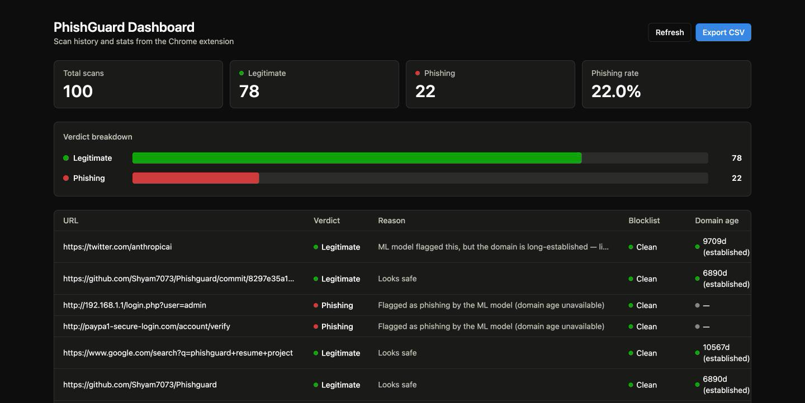
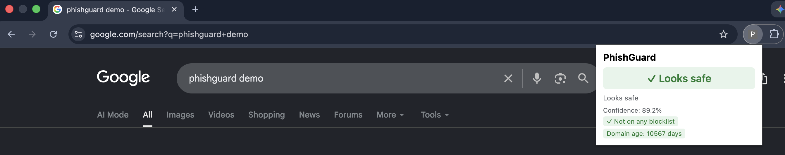

# PhishGuard

Real-time phishing URL detection. A Chrome extension scans every page you
navigate to, a FastAPI backend combines three independent signals into one
**explainable** verdict, and a React dashboard shows the scan history.

The point isn't a single confidence number — it's the *reason* behind it:

> ⚠️ **Likely phishing** — 99.7%
> Confirmed malicious — found on the URLhaus blocklist

> ✓ **Looks safe** — 65%
> ML model flagged this, but the domain is long-established — likely a false positive

## Screenshots

<!-- TODO: capture these before sharing. Suggested: run the backend + dashboard,
     seed a few scans (a real search URL, a fake PayPal lookalike, an IP-address
     login URL), then screenshot. Unload the extension first, or expect a
     localhost:5173 row in the history table. -->

| Dashboard | Extension popup |
|---|---|
|  |  |

## How it works

```
Chrome Extension ──┐                    ┌──> ML inference (17 lexical features, XGBoost)
                   ├──> FastAPI /scan ──┼──> URLhaus blocklist lookup
React Dashboard ───┘         │          └──> RDAP domain-age lookup
                             │
                             ├──> combine_verdict()  ──> is_phishing + confidence + reason
                             └──> SQLite (scan history) ──> /history, /reports (CSV)
```

### The three signals

| Signal | Source | Cost |
|---|---|---|
| **ML phishing probability** | 17 lexical features of the URL string, XGBoost | Local, no network |
| **Blocklist status** | URLhaus (abuse.ch), 15-min cache | 1 HTTP call |
| **Domain age** | RDAP via `whodap`, 24-hour cache | 1 HTTP call |

### How they combine (`backend/app/verdict.py`)

The combining rules are deliberately **asymmetric** — a positive hit can
override a verdict, but an *absence* of evidence never inverts one:

1. **A URLhaus hit wins outright.** A known-bad URL is a fact, not a guess.
2. Otherwise the ML score decides (threshold 0.5), **except**:
3. An **established** domain (≥365 days) rescues a *borderline* ML phishing
   call (< 0.90) back to legitimate. This is the fix for the residual false
   positives below — a lexical-only model has no way to know a domain is 18
   years old.
4. A **newly-registered** domain does **not** get the mirror treatment. It
   won't flip a legitimate call to phishing, only annotate the reason.
   Flipping would create a whole new false-positive class on genuinely new
   legitimate sites (personal pages, startups), which is untested here.

Every lookup fails soft: any timeout or error degrades to `"unknown"` and the
verdict falls back to ML-only, with the degradation stated in the reason text.

## The ML model

17 features computed from the URL string alone — no page fetch, no network
call, so inference stays fast and fully explainable:

- **Length**: `url_length`, `hostname_length`, `path_length`
- **Character counts**: dots, hyphens, underscores, slashes, digits, special chars, `digit_ratio`
- **Structure**: `num_subdomains` (via `tldextract`), `num_query_params`
- **Red flags**: `has_ip_address`, `has_at_symbol`, `is_https`, `has_suspicious_word`, `is_url_shortener`

`ml/features.py` is imported by *both* the training pipeline and the backend,
so train-time and serve-time features can never drift apart.

**Trained on** 130,000 balanced URLs — 65k legitimate (Tranco top 1M) and 65k
verified phishing (PhishTank). Logistic Regression, Random Forest and XGBoost
are all trained and compared on a held-out 20% split; see `ml/MODEL_REPORT.md`
for the full table.

**Current shipped model: XGBoost — 91.77% accuracy, 0.9164 F1.**

### Why the accuracy went *down* over time (the interesting part)

Early runs hit 96.5%, and even 99.6% before that. Those numbers were fake, and
finding out why is most of the engineering in this project. Tranco provides
bare apex domains, so the synthetic legitimate URLs had structural tells the
real web doesn't have — and the model happily learned the tells instead of
phishing:

| # | Symptom | Root cause | Fix |
|---|---|---|---|
| 1 | 99.6% across *all three* models | 100% of legit URLs had no path at all | Generate realistic paths |
| 2 | `num_subdomains` = 88% of importance | Tranco never includes `www.` | Add subdomain prefixes |
| 3 | `mail.google.com/mail/u/0/` flagged | `num_slashes ≥ 6` was 0% of legit rows | Compositional path generator |
| 4 | `launchpad.ccbp.in/` at 72% | Bare trailing slash under-represented | Reweight bare-root shapes |
| 5 | A real Google search URL at 99.9996% | Legit URLs never exceeded 213 chars | Add tracking-param blobs |
| 6 | A GitHub commit URL at 98.9% | `digit_ratio ≥ 0.6` 120× rarer in legit | Add hex + numeric token shapes |

Each one was diagnosed with **per-feature contribution analysis**
(`booster.predict(..., pred_contribs=True)`), not guesswork, and confirmed
with a **by-class coverage audit**: find any feature value appearing in ≥0.5%
of one class but 0% of the other — the exact shape of the bug, every time.

Every fix went into the synthetic data generator (`ml/prepare_dataset.py`).
**The model itself was never made more complex.** Each accuracy drop is a real
artifact being removed, so the lower number is the more honest one.

## Repo layout

| Path | Purpose |
|---|---|
| `ml/` | Dataset prep, feature engineering, training/evaluation (offline only) |
| `backend/` | FastAPI service: `/scan`, `/history`, `/reports`, `/health` |
| `backend/app/threat_intel/` | URLhaus + RDAP lookups, shared TTL cache |
| `extension/` | Chrome extension (Manifest V3) — background worker + popup |
| `dashboard/` | React + Tailwind dashboard |

The training pipeline is fully decoupled from the serving path: `ml/` exports
a model artifact, `backend/` only ever loads and runs it. Dependencies are
split accordingly (`ml/requirements.txt` vs `backend/requirements.txt`) so a
deployed API would never install pandas or matplotlib.

## Setup

```bash
make setup   # creates .venv, installs ml + backend + dev dependencies
```

Create a `.env` in the repo root (gitignored) with a free key from
[auth.abuse.ch](https://auth.abuse.ch):

```
URLHAUS_AUTH_KEY=your_key_here
```

Without it, URLhaus lookups degrade to `"unknown"` and the verdict falls back
to ML + domain age — the app still runs.

### Train the model

The dataset and model artifact are both gitignored, so generate them first.
Place the Tranco and PhishTank CSVs in `ml/data/raw/`, then:

```bash
.venv/bin/python ml/prepare_dataset.py   # -> ml/data/processed/dataset.csv
.venv/bin/python -m ml.train             # -> ml/models/model.joblib + MODEL_REPORT.md
```

### Run the backend

From the repo root, so both `backend` and `ml` resolve as packages:

```bash
.venv/bin/python -m uvicorn backend.app.main:app --reload
```

Interactive API docs at `http://127.0.0.1:8000/docs`.

### Run the dashboard

```bash
cd dashboard && npm install && npm run dev
```

### Load the extension

With the backend running: open `chrome://extensions`, enable **Developer
mode**, click **Load unpacked**, select the `extension/` folder. See
`extension/README.md`.

## Testing

```bash
make test    # 27 tests
make lint    # ruff + black --check
```

Backend tests use FastAPI's `TestClient` against an **in-memory SQLite**
database (`StaticPool`, dependency-overridden in `conftest.py`), so they never
touch the real `phishguard.db`. Both threat-intel lookups are monkeypatched —
**the suite makes zero network calls**, which keeps it fast and deterministic
rather than dependent on a live, constantly-changing blocklist.

Mocked tests have limits, though, and this project hit them twice: two real
bugs (a naive-`datetime` crash on some RDAP registries, and `whodap`
re-fetching the IANA bootstrap registry on *every* call, blowing the timeout)
were only ever caught by live smoke tests against real domains. Every
milestone is verified end-to-end against a real running backend, not just the
test suite.

## Known limitations

Stated plainly rather than hidden — these are the honest edges of the design:

- **RDAP coverage isn't universal.** Strong for gTLDs (mandatory for `.com`/
  `.org`/`.net`), patchier for some ccTLDs. Falls back to `"unknown"`.
- **The domain-age rescue only applies to borderline calls.** A compromised or
  deliberately aged domain hosting real phishing still needs a confident ML or
  URLhaus signal to be caught. Accepted trade-off, not an oversight.
- **Tranco popularity ≠ legitimacy.** The top 1M includes some parked and
  low-quality domains, so a fraction of the "legitimate" labels are noisy.
- **Lexical features can't see content.** No page fetch, no DOM inspection, no
  favicon/visual similarity. Deliberate: safely fetching arbitrary
  possibly-malicious pages is a much bigger problem than it looks.
- **Local-only by design.** No Docker, no deployment, permissive CORS
  (`allow_origins=["*"]`). Fine for a local project; not a hardened API.

## Status

All 14 milestones complete. See `TODO.md` for the task-level breakdown and
`PROJECT_PROGRESS.md` for the full per-milestone engineering log, including
every false-positive investigation and the reasoning behind each design call.

## License

MIT — see `LICENSE`.
